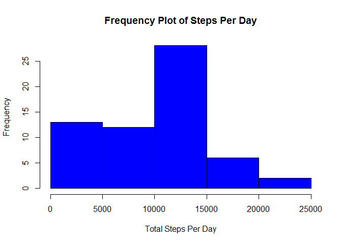
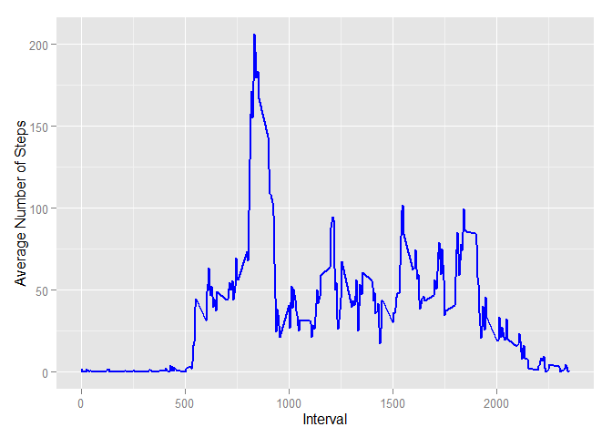
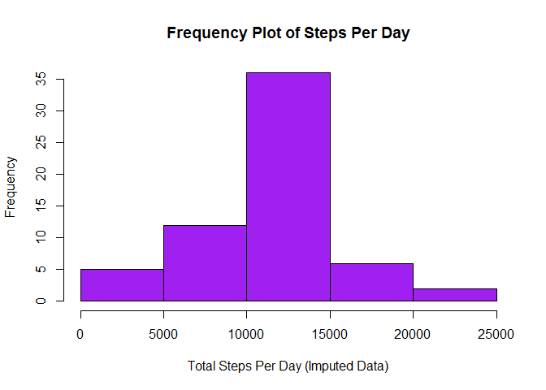
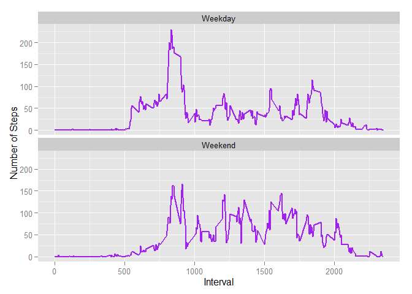

# Peer Assessment 1
Ramesh Subramanian  
Saturday, May 16, 2015  
## Loading and Preprocessing the Data

Load the data, add a column to show week days


```r
activity <- read.csv("activity.csv",colClasse = c("numeric","Date","numeric"))
activity$day <- weekdays(activity$date)
```

## What is mean total number of steps taken per day?

Calculate total number of steps taken per day


```r
require(dplyr)
```

```
## Loading required package: dplyr
```

```
## Warning: package 'dplyr' was built under R version 3.1.3
```

```
## 
## Attaching package: 'dplyr'
## 
## The following object is masked from 'package:stats':
## 
##     filter
## 
## The following objects are masked from 'package:base':
## 
##     intersect, setdiff, setequal, union
```

```r
activity_tbl <- tbl_df(activity)
by_day <- group_by(activity_tbl,date)
total_steps_per_day <- summarise(by_day,
                                 Total_Steps_Per_Day = sum(steps, na.rm=TRUE))
```

Plot a histogram of the frequency of total steps taken per day


```r
hist(total_steps_per_day$Total_Steps_Per_Day, 
     main="Frequency Plot of Steps Per Day", 
     xlab = "Total Steps Per Day", ylab="Frequency",
     col = "Blue")
```

 

Calculate Mean and Median value of total steps taken per day


```r
sprintf("Mean is %.0f steps", 
        as.numeric(mean(total_steps_per_day$Total_Steps_Per_Day)))
```

```
## [1] "Mean is 9354 steps"
```

```r
sprintf("Median is %.0f steps", 
        as.numeric(median(total_steps_per_day$Total_Steps_Per_Day)))
```

```
## [1] "Median is 10395 steps"
```

## What is the average daily activity pattern?

Aggregate average steps by interval i.e. 0..2355 for each date and plot a time series


```r
require(ggplot2)
```

```
## Loading required package: ggplot2
```

```
## Warning: package 'ggplot2' was built under R version 3.1.3
```

```r
Avg_steps_by_interval <- aggregate(steps ~ interval, 
                                   activity_tbl, mean, na.rm=TRUE)

ggplot(Avg_steps_by_interval, aes(x=interval,y=steps)) + 
  geom_line(color="blue",size=1, aes(group = 1)) +  
  labs(x="Interval",y="Average Number of Steps")
```

 

Identify the 5 minute interval which has the highest average number of steps across all days


```r
sprintf("Interval with highest average number of steps across all days is %0.f",
        Avg_steps_by_interval[which.max(Avg_steps_by_interval$steps),]$interval)
```

```
## [1] "Interval with highest average number of steps across all days is 835"
```

## Imputing missing values

Number of NA (missing) step values in the dataset

```r
sprintf("Number of missing values in the data is %0.f", 
        sum(is.na(activity_tbl)))
```

```
## [1] "Number of missing values in the data is 2304"
```

Strategy is to replace the missing value with the average for that interval, e.g. if there is a NA for interval 5, it gets the average of the interval 5 across all days and so on.

Create a new dataset with the imputed values replacing the missing values


```r
activity_impute_tbl <- merge(activity_tbl, Avg_steps_by_interval, 
                             by = "interval")
activity_impute_tbl <- mutate(activity_impute_tbl,
                              steps.x = ifelse(is.na(steps.x),steps.y,steps.x))
```

Plot a Histogram of this new dataset 


```r
by_day <- group_by(activity_impute_tbl,date)
total_steps_per_day <- summarise(by_day,Total_Steps_Per_Day = sum(steps.x))
hist(total_steps_per_day$Total_Steps_Per_Day, 
     main="Frequency Plot of Steps Per Day", 
     xlab = "Total Steps Per Day (Imputed Data)", ylab="Frequency",
     col = "Purple")
```

 

Compute Mean and Median


```r
sprintf("Mean is %.0f steps", 
        as.numeric(mean(total_steps_per_day$Total_Steps_Per_Day)))
```

```
## [1] "Mean is 10766 steps"
```

```r
sprintf("Median is %.0f steps", 
        as.numeric(median(total_steps_per_day$Total_Steps_Per_Day)))
```

```
## [1] "Median is 10766 steps"
```

Implication of imputing missing values:
1. Original histogram with missing values is left skewed and there is a significant difference between Mean and Median Total steps per day
2. Adding the average interval value for missing values makes the mean and median converge (i.e they are the same) and the Histogram shows a normal distribution

## Are there differences in activity patterns between weekdays and weekends?

Replace days of week with 'Weekday' or 'Weekend'


```r
activity_impute_tbl$day <- ifelse(activity_impute_tbl$day 
                                  %in% c("Saturday", "Sunday"),
                                  "Weekend", "Weekday")
```

Aggregate mean and plot time series 


```r
Avg_steps_by_interval_imputed <- aggregate(steps.x ~ interval + day, 
                                   activity_impute_tbl, mean)

ggplot(Avg_steps_by_interval_imputed, aes(x=interval,y=steps.x)) + 
  geom_line(color="purple",size=1) + 
  facet_wrap(~day, nrow=2, ncol=1) + 
  labs(x="Interval",y="Number of Steps") 
```

 

Yes, there is a difference in the activity pattern between weekdays and weekends.
1. During Weekdays, there is more activity in the early part of the day, followed by a lull in activity (presumably, everyone is at work) and the activity picks up again towards the end of the day
2. During weekends, there is also more activity during the early part of the day but the activity level is sustained throughout the day as people are going about finishing their chores or just being more active.
